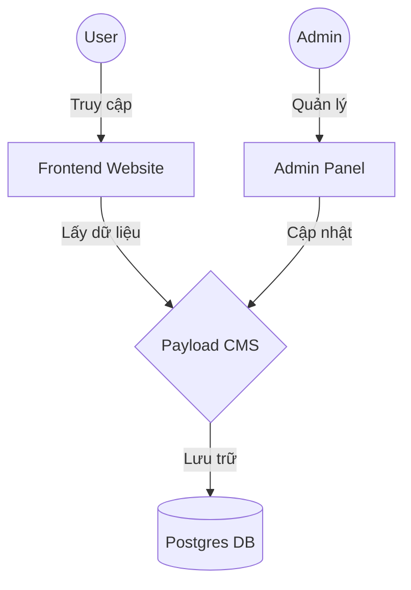

# Payload CMS + Next.js Website Template

https://payloadcms.com/docs/getting-started/what-is-payload

Đây là template website tích hợp sẵn **Payload CMS** và **Next.js App Router**, được thiết kế để triển khai website tin tức, blog hoặc trang giới thiệu doanh nghiệp một cách nhanh chóng.

Tài liệu về Seo của Nextjs . Seo là nguyên nhân cốt lõi chọn payload cms để xây dựng website này.
https://nextjs.org/learn/seo/importance-of-seo

## 🌟 Tính năng Nổi bật

Dự án này được cấu hình sẵn các tính năng cốt lõi cần thiết cho hầu hết các website:

- **Authentication (Xác thực)**: Hệ thống đăng nhập, quản lý Users.
- **Layout Builder**: Xây dựng giao diện trang động bằng cách kéo thả các khối (Hero, Content, Media, Archive, Form...).
- **Draft & Live Preview**:
  - _Draft_: Lưu nháp bài viết, xem trước trước khi publish.
  - _Live Preview_: Xem thay đổi nội dung ngay lập tức trên giao diện website mà không cần reload.
- **SEO**: Tích hợp sẵn plugin SEO để quản lý meta title, description, image...
- **On-demand Revalidation**: Tự động cập nhật cache của Next.js khi nội dung thay đổi trên CMS.
- **Redirects**: Quản lý chuyển hướng URL 301/302 ngay trong admin.
- **Scheduled Publishing**: Lên lịch đăng bài tự động.

---

### Yêu cầu hệ thống

- Node.js (phiên bản 18.20.2 trở lên hoặc 20.9.0 trở lên).
- Trình quản lý gói: `pnpm`.
- Cơ sở dữ liệu: Postgres (Project này sử dụng Postgres làm database mặc định).

## 🚀 Hướng dẫn Cài đặt & Chạy (Quick Start)

** lưu ý dự án chạy cả fe và be nên phải chạy docker trước **

1.  **Clone dự án** (nếu chưa clone):

    ```bash
    git clone <your-repo-url>
    cd <your-project-folder>
    ```

2.  **Cài đặt dependencies**:'pnpm install'

3.  **Thiết lập biến môi trường**:
    - Copy file `.env.example` thành `.env`:
      ```bash
      cp .env.example .env
      ```
    - Mở file `.env` và điền thông tin kết nối Database (`DATABASE_URI`) và `PAYLOAD_SECRET`.

4.  **Chạy máy chủ phát triển (Dev Server)**:

    ```
    pnpm dev
    ```

5.  **Truy cập**:
    - Frontend: `http://localhost:3000`
    - Admin Panel: `http://localhost:3000/admin`

### 🐳 Chạy với Docker

```bash
docker-compose up
```

Lệnh này sẽ tự động khởi động database và server Next.js.

### 📜 Bảng lệnh CLI thường dùng

| Lệnh (PNPM)           | Ý nghĩa                                |
| :-------------------- | :------------------------------------- |
| `pnpm dev`            | Chạy server dev (hot-reload)           |
| `pnpm build`          | Build code cho production              |
| `pnpm start`          | Chạy server production (sau khi build) |
| `pnpm generate:types` | Tạo TypeScript types từ Collections    |
| `pnpm lint`           | Kiểm tra lỗi code (Linting)            |

| Lệnh (Docker)         | Ý nghĩa                          |
| :-------------------- | :------------------------------- |
| `docker-compose up`   | Bật toàn bộ dự án                |
| `docker-compose down` | Tắt và xóa containers            |
| `docker-compose logs` | Hiển thị log                     |
| `docker-compose ps`   | Hiển thị các container đang chạy |

---

## 📂 Cấu trúc Dự án & Chức năng Thư mục

### Sơ đồ kiến trúc



### Cây thư mục chi tiết

Dưới đây là sơ đồ cây thư mục giải thích vị trí và chức năng của từng thành phần quan trọng trong `src/`:

```
src/
├── app/                        # 🌐 Main Routing
│   ├── (frontend)/             #     Giao diện Frontend (Next.js App Router)
│   └── (payload)/              #     Giao diện Admin Panel (PayloadCMS)
├── collections/                # 🗄️ Database Schemas (Các bảng dữ liệu)
│   ├── Pages/                  #     Cấu hình trang tĩnh
│   ├── Posts/                  #     Cấu hình bài viết
│   ├── Users/                  #     Cấu hình người dùng
│   └── Media/                  #     Cấu hình file upload
├── blocks/                     # 🧩 Layout Blocks (Các khối giao diện)
│   ├── ArchiveBlock/           #     Khối danh sách bài viết
│   ├── Content/                #     Khối nội dung rich-text
│   └── CallToAction/           #     Khối kêu gọi hành động (CTA)
├── components/                 # ⚛️ React Components (Button, Card, Header...)
├── heros/                      # 🖼️ Hero Sections (Banner đầu trang)
├── access/                     # 🛡️ Access Control (Quyền truy cập)
├── hooks/                      # 🪝 Custom Hooks
└── payload.config.ts           # ⚙️ File cấu hình chính của CMS
```

### Bảng chức năng chi tiết

| Thư mục                     |    Loại    | Mô tả & Nhiệm vụ                                                                                                                                             |
| :-------------------------- | :--------: | :----------------------------------------------------------------------------------------------------------------------------------------------------------- |
| **`src/app`**               | 🌐 Routing | **Trái tim của ứng dụng**. Quản lý toàn bộ đường dẫn.<br>• `(frontend)`: Render giao diện người dùng.<br>• `(payload)`: Render giao diện quản trị viên.      |
| **`src/collections`**       |  🗄️ Model  | **Định nghĩa dữ liệu**. Nơi khai báo các trường dữ liệu (fields).<br>Muốn thêm tính năng mới như "Sản phẩm"? -> Tạo `Products` collection tại đây.           |
| **`src/blocks`**            |   🧩 UI    | **Các mảnh ghép giao diện**. Dùng cho Layout Builder.<br>Cho phép Admin tự do sắp xếp bố cục trang (ví dụ: đặt Banner trên, rồi đến Bài viết, rồi đến Form). |
| **`src/components`**        |   ⚛️ UI    | **Thành phần tái sử dụng**. Chứa các UI components nhỏ (Button, Input, Card) được dùng chung cho cả Frontend và các Blocks.                                  |
| **`src/payload.config.ts`** | ⚙️ Config  | **Trung tâm điều khiển**. Nơi đăng ký mọi thứ: Collections, Blocks, Plugins, Database adapter.                                                               |

---

## 🛠 Cách hoạt động chính (Core Concepts)

### 1. Layout Builder

Thay vì fix cứng giao diện, mỗi **Page** hoặc **Post** có một field gọi là `layout`. Bạn có thể thêm các blocks vào field này theo thứ tự tùy ý:

- Muốn thêm banner quảng cáo? -> Thêm block `CallToAction`.
- Muốn viết nội dung dài? -> Thêm block `Content`.
- Muốn hiện list bài viết liên quan? -> Thêm block `Archive`.

### 2. SEO Plugin

Truy cập tab **SEO** trong khi chỉnh sửa Page/Post để cài đặt:

- Meta Title, Meta Description.
- OG Image (ảnh đại diện khi chia sẻ Facebook/Zalo).
- Preview xem trước hiển thị trên Google.

### 3. Database Migration

Khi bạn thay đổi code trong `src/collections` (ví dụ thêm field mới), Payload dùng adapter Postgres nên bạn cần chạy migration (ở môi trường Production, local có thể bật `push: true`).

- Tạo migration: `pnpm payload migrate:create`
- Chạy migration: `pnpm payload migrate`

---

## 📦 Triển khai (Production)

Để build ứng dụng cho môi trường production:

1.  **Build**:

    ```bash
    pnpm build
    ```

    Lệnh này sẽ build cả Next.js và Payload Admin panel.

2.  **Start**:
    ```bash
    pnpm start
    ```

### Lưu ý khi Deploy

- Đảm bảo set biến môi trường `PAYLOAD_SECRET` mạnh và bảo mật.
- Cấu hình `DATABASE_URI` trỏ tới Postgres production.
- Nếu dùng Vercel, cài đặt thêm adapter cho Vercel Postgres hoặc sử dụng Database rời (Supabase, Neon, AWS RDS...).
